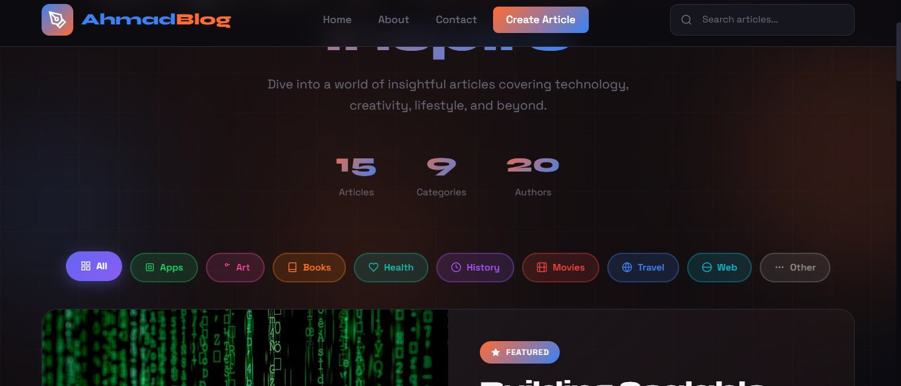

# AhmadBlog ✦

> A beautiful, dark-themed blog platform built with Node.js, Express & EJS — deployed on AWS EC2 using Docker.



<div align="center">

[](https://nodejs.org)
[](https://expressjs.com)
[](https://docker.com)
[](https://aws.amazon.com)
[](LICENSE)

**🌐 Live Demo:** [http://18.116.201.138](http://18.116.201.138)

</div>

---

## ✨ Features

- 🌑 **Dark theme** — sleek, modern UI inspired by the AhmadBlog design
- 🏠 **Home page** — featured post hero, stats counter, category filters & search
- 📄 **Post page** — full article view with author info & related posts sidebar
- 📱 **Responsive** — works on mobile, tablet & desktop
- 🐳 **Dockerized** — one command to build & run anywhere
- 🔍 **Search & Filter** — filter by category or search by title/keyword
- 📦 **No database needed** — data stored in `data/posts.js` (easy to swap with SQL later)

---

## 📁 Project Structure

```
ahmad-blog/
├── Dockerfile          ← Docker image blueprint
├── .dockerignore       ← Files excluded from Docker build
├── package.json        ← Dependencies
├── server.js           ← Express server + routes
├── data/
│   └── posts.js        ← Blog posts data (replaces SQL for now)
├── public/
│   └── styles.css      ← Full dark theme CSS
├── views/
│   ├── index.ejs       ← Home page template
│   └── post.ejs        ← Single post page template
└── screenshot.png      ← App preview
```

---

## 🚀 Local Setup

```bash
# 1. Clone the repo
git clone https://github.com/Ahmadansari1942/ahmad-blog.git
cd ahmad-blog

# 2. Install dependencies
npm install

# 3. Start the server
npm start

# 4. Open in browser
# http://localhost:3000
```

---

## 🐳 Docker Setup

```bash
# Build the image
docker build -t ahmad-blog .

# Run the container
docker run -d \
  --name ahmad-blog \
  --restart unless-stopped \
  -p 80:3000 \
  ahmad-blog

# Check it's running
docker ps

# View logs
docker logs ahmad-blog
```

---

## ☁️ AWS EC2 Deployment

### 1. Security Group Rules

| Port | Protocol | Source      | Purpose              |
|------|----------|-------------|----------------------|
| 22   | TCP      | Your IP     | SSH access           |
| 80   | TCP      | 0.0.0.0/0   | Public HTTP traffic  |
| 3000 | TCP      | 0.0.0.0/0   | Direct Node.js test  |

### 2. EC2 Commands (Ubuntu)

```bash
# SSH into EC2
ssh -i "your-key.pem" ubuntu@18.116.201.138

# Install Docker
sudo apt update && sudo apt install -y docker.io git
sudo systemctl start docker && sudo systemctl enable docker
sudo usermod -aG docker $USER && exit

# Re-login, then clone & run
git clone https://github.com/Ahmadansari1942/ahmad-blog.git
cd ahmad-blog
docker build -t ahmad-blog .
docker run -d --name ahmad-blog --restart unless-stopped -p 80:3000 ahmad-blog
```

### 3. Update Deployment

```bash
cd ~/ahmad-blog
git pull origin main
docker stop ahmad-blog && docker rm ahmad-blog
docker rmi ahmad-blog
docker build -t ahmad-blog .
docker run -d --name ahmad-blog --restart unless-stopped -p 80:3000 ahmad-blog
```

---

## 🛠️ Tech Stack

| Layer      | Technology               |
|------------|--------------------------|
| Runtime    | Node.js 20               |
| Framework  | Express.js 4             |
| Templating | EJS                      |
| Styling    | Vanilla CSS (dark theme) |
| Container  | Docker (Alpine)          |
| Hosting    | AWS EC2                  |

---

## 👤 Author

**Ahmad Ansari**  
GitHub: [@Ahmadansari1942](https://github.com/Ahmadansari1942)

---

<div align="center">
Made with ❤️ — AhmadBlog © 2026
</div>
