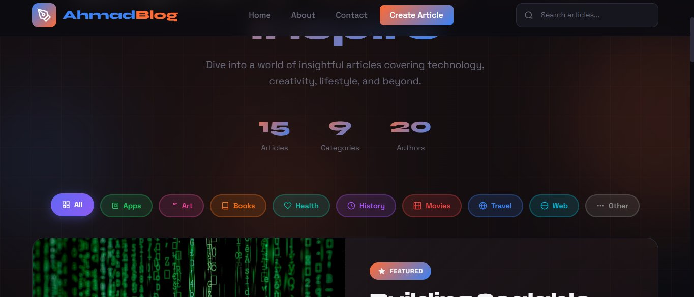

# AhmadBlog ✦

> A dark-themed blog platform (Node.js + Express + EJS + MySQL) deployed as a **three-tier app on Kubernetes (kubeadm on AWS EC2) with ArgoCD GitOps**.



<div align="center">

[](https://nodejs.org)
[](https://expressjs.com)
[](https://docker.com)
[](https://kubernetes.io)
[](https://argo-cd.readthedocs.io)
[](https://aws.amazon.com)
[](LICENSE)

</div>

---

## ✨ Features

- 🌑 **Dark theme** — sleek, modern UI inspired by the AhmadBlog design
- 🏠 **Home page** — featured post hero, stats counter, category filters & search
- 📄 **Post page** — full article view with author info & related posts sidebar
- 📱 **Responsive** — works on mobile, tablet & desktop
- 🐳 **Dockerized** — multi-stage, non-root image
- ☸️ **Kubernetes + ArgoCD** — GitOps, health probes, HPA, NetworkPolicies, nightly DB backups
- 🔍 **Search & Filter** — filter by category or search by title/keyword
- 🗄️ **MySQL data tier** — auto-migrated and seeded from `data/posts.js`

---

## 🏗️ Architecture

```
Internet ─▶ Traefik (web tier) ─▶ Node/Express x2 (app tier) ─▶ MySQL 8.4 (data tier)
                     └──────────── Kubernetes (kubeadm: 1 master + 1 worker on EC2) ────────────┘
git push ─▶ GitHub Actions (test, build, Trivy scan, push image:<sha>) ─▶ tag committed to git ─▶ ArgoCD deploys
```

## 📁 Project Structure

```
ahmad-blog/
├── app.js / server.js      ← Express app, health (/healthz /readyz), graceful shutdown
├── lib/                    ← MySQL store (with in-memory fallback), metrics, logger
├── data/posts.js           ← seed data (loaded into MySQL on first start)
├── views/  public/         ← EJS templates, CSS
├── test/                   ← node:test suite (npm test)
├── Dockerfile              ← multi-stage, non-root image
├── k8s/
│   ├── base/               ← Deployment, Service, Ingress, HPA, PDB, NetworkPolicies, MySQL StatefulSet, backup CronJob
│   ├── overlays/prod/      ← image tag (bumped by CI)
│   └── optional/           ← ServiceMonitor, TLS (cert-manager)
├── argocd/                 ← app-of-apps: projects, Traefik, metrics-server, the blog (+ optional monitoring/cert-manager)
├── scripts/                ← kubeadm / Calico / ArgoCD / secrets bootstrap
├── docs/DEPLOY.md          ← step-by-step production deployment
└── .github/workflows/ci-cd.yml
```

---

## 🚀 Local Setup

```bash
git clone https://github.com/Ahmadansari1942/ahmad-blog.git
cd ahmad-blog
npm install
npm test
npm start                    # http://localhost:3000  (in-memory data, no DB needed)
```

### With a local MySQL (same as production)

```bash
docker run -d --name blog-db -e MYSQL_ROOT_PASSWORD=root -e MYSQL_DATABASE=blog \
  -e MYSQL_USER=bloguser -e MYSQL_PASSWORD=blogpass -p 3306:3306 mysql:8.4
DB_HOST=127.0.0.1 DB_NAME=blog DB_USER=bloguser DB_PASSWORD=blogpass npm start
```
Tables are created and seeded automatically on first start.

| Env var | Default | Notes |
|---|---|---|
| `DB_HOST` | *(empty)* | empty = in-memory data (dev only) |
| `DB_PORT` / `DB_NAME` / `DB_USER` / `DB_PASSWORD` | 3306 / – / – / – | |
| `PORT` / `METRICS_PORT` | 3000 / 9100 | metrics are on a separate, non-public port |

---

## ☁️ Production deployment (AWS EC2 + Kubernetes + ArgoCD)

See **[docs/DEPLOY.md](docs/DEPLOY.md)** for the complete guide (security groups, bootstrap scripts, GitOps flow, backups, rollback, troubleshooting).

---

## 🛠️ Tech Stack

| Layer      | Technology               |
|------------|--------------------------|
| Runtime    | Node.js 22               |
| Framework  | Express.js 4             |
| Templating | EJS                      |
| Styling    | Vanilla CSS (dark theme) |
| Database   | MySQL 8.4                |
| Container  | Docker (Alpine, multi-stage) |
| Orchestration | Kubernetes (kubeadm), Calico, Traefik |
| GitOps / CI | ArgoCD, GitHub Actions, Trivy |
| Hosting    | AWS EC2 (1 master + 1 worker) |

---

## 👤 Author

**Ahmad Ansari**  
GitHub: [@Ahmadansari1942](https://github.com/Ahmadansari1942)

---

<div align="center">
Made with ❤️ — AhmadBlog © 2026
</div>
